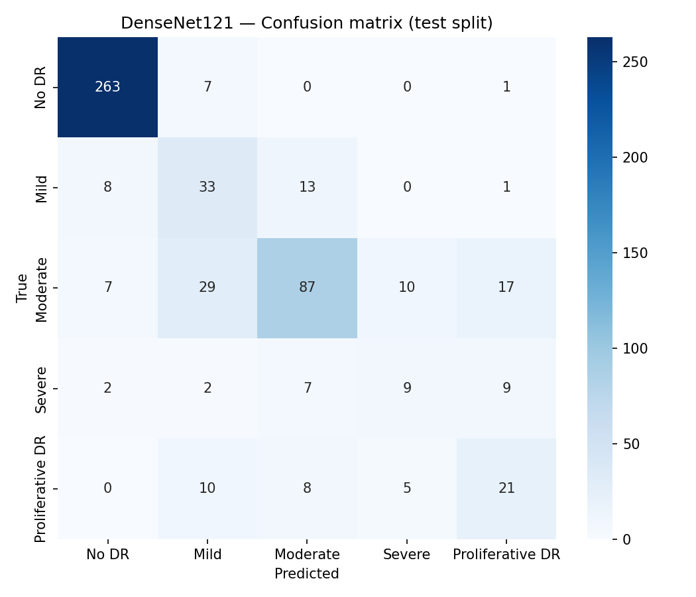
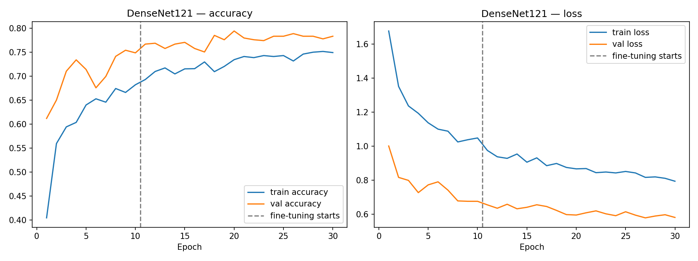

# Diabetic Retinopathy Severity Classification — DenseNet + Backend (Member 3)

Part of the team project **"Comparative Analysis of Deep Learning Models for Diabetic Retinopathy Severity Classification"** (DenseNet vs ResNet vs EfficientNet).

- **Dataset:** APTOS 2019 Blindness Detection (5 classes: 0 No DR, 1 Mild, 2 Moderate, 3 Severe, 4 Proliferative DR)
- **Model:** DenseNet121, ImageNet transfer learning, two-phase training
- **Framework:** TensorFlow / Keras (model saved as `.keras`)
- **Training:** Google Colab (T4 GPU)
- **Backend:** prediction API (`/health`, `/model-info`, `/predict`) — *in progress*

Model and preprocessing details: [docs/densenet_model.md](docs/densenet_model.md)
Shared team settings: [docs/common_experiment_settings.md](docs/common_experiment_settings.md)

## Project structure

| Path | Contents |
|---|---|
| `src/config.py` | All settings (image size, classes, learning rates, epochs, seed) |
| `src/preprocessing.py` | Image loading/decoding, black-border crop, resize — shared by training and backend |
| `src/model.py` | DenseNet121 model, fine-tuning setup, compile |
| `src/data.py` | Stratified split, dataset loading, tf.data pipeline with augmentation |
| `src/train.py` | Two-phase training, saves model + history + info |
| `src/evaluate.py` | Test metrics, confusion matrix, training curves |
| `src/predict.py` | `DRPredictor` + command-line sample prediction |
| `notebooks/00_download_dataset.ipynb` | Downloads APTOS into Google Drive (run once) |
| `notebooks/01_densenet_training.ipynb` | Training + evaluation + sample predictions on Colab |
| `tests/` | Tests for preprocessing, model and the full pipeline |
| `models/` | Trained model files (not committed — too large) |
| `results/` | Metrics and plots |
| `docs/` | Documentation |

## Setup (local machine, CPU)

```bash
python3 -m venv --without-pip .venv
curl -sSL https://bootstrap.pypa.io/get-pip.py | .venv/bin/python   # only if venv has no pip
source .venv/bin/activate
pip install --no-cache-dir -r requirements.txt
```

## Training (Google Colab)

1. Run `notebooks/00_download_dataset.ipynb` once (needs a Kaggle token in Colab Secrets).
2. Open `notebooks/01_densenet_training.ipynb` in Colab, select **T4 GPU**, **Run all**.
3. Download `densenet121_dr.keras` and `densenet121_dr_info.json` from `MyDrive/DR_project/densenet121/` into `models/`.

## Sample prediction (local)

```bash
source .venv/bin/activate
python -m src.predict --model models/densenet121_dr.keras --image path/to/fundus.png
```

Output:
```json
{"class_id": 2, "class_name": "Moderate", "confidence": 0.81, "probabilities": {"No DR": 0.02, "...": 0.0}}
```

## Tests

```bash
source .venv/bin/activate
python -m pytest tests/ -v
```

The pipeline test trains on 50 synthetic images for 1 epoch per phase, so it checks that
everything runs end to end. It does not measure accuracy.

## Results (DenseNet121, test split = 549 images)

| Metric | Value |
|---|---|
| Accuracy | 0.752 |
| Quadratic Weighted Kappa | 0.808 |
| Macro F1 | 0.578 |
| Weighted F1 | 0.753 |
| Parameters | 7,042,629 |
| Model file | 46.8 MB |
| Inference (Colab T4, batched) | 76.15 ms / image |
| Training | 30 epochs (10 head + 20 fine-tune), 17.7 min on T4 |

| Class | Precision | Recall | F1 | Test images |
|---|---|---|---|---|
| No DR | 0.94 | 0.97 | 0.95 | 271 |
| Mild | 0.41 | 0.60 | 0.49 | 55 |
| Moderate | 0.76 | 0.58 | 0.66 | 150 |
| Severe | 0.38 | 0.31 | 0.34 | 29 |
| Proliferative DR | 0.43 | 0.48 | 0.45 | 44 |



