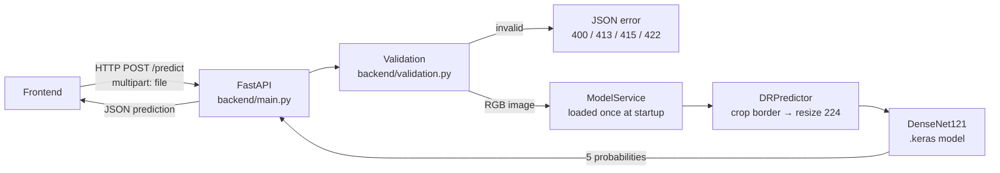

# API Documentation — Diabetic Retinopathy Severity API

Base URL (local): `http://127.0.0.1:8000`
Interactive docs (try requests in the browser): `http://127.0.0.1:8000/docs`

> Research prototype for a college project. Not a medical diagnosis.

## Architecture



## Start the server

```bash
cd ~/diabetic-retinopathy-member3
source .venv/bin/activate
uvicorn backend.main:app --host 127.0.0.1 --port 8000
```

Startup takes ~12 s (TensorFlow import + model load + one warm-up prediction).
Wait for `Model loaded and warmed up` in the log.

| Environment variable | Default | Meaning |
|---|---|---|
| `DR_MODEL_PATH` | `models/densenet121_dr.keras` | model file |
| `DR_MODEL_INFO_PATH` | `models/densenet121_dr_info.json` | model metadata |
| `DR_MAX_FILE_SIZE_MB` | `10` | upload size limit |
| `DR_CORS_ORIGINS` | `*` | allowed frontend origins, comma-separated (e.g. `http://localhost:3000`) |

---

## GET /health

Is the server running and the model ready?

```bash
curl http://127.0.0.1:8000/health
```

```json
{"status": "ok", "model_loaded": true, "uptime_seconds": 13.6}
```

`status` is `"degraded"` and `model_loaded` is `false` if the model failed to load.

---

## GET /model-info

Model details, classes, preprocessing and upload limits.

```bash
curl http://127.0.0.1:8000/model-info
```

```json
{
  "model_loaded": true,
  "load_error": null,
  "model": "DenseNet121",
  "framework": "TensorFlow 2.20.0 / Keras 3.13.2",
  "input_size": [224, 224, 3],
  "classes": {"0": "No DR", "1": "Mild", "2": "Moderate", "3": "Severe", "4": "Proliferative DR"},
  "preprocessing": {
    "steps": ["BGR->RGB", "crop black border", "resize 224x224", "ImageNet normalisation (inside model)"],
    "use_ben_graham": false
  },
  "training": {"weights": "imagenet", "split_sizes": {"train": 2564, "val": 549, "test": 549},
               "epochs_trained": 30, "trained_at": "2026-10-04 14:05:31"},
  "upload_limits": {"allowed_types": [".jpeg", ".jpg", ".png"], "max_file_size_mb": 10.0,
                    "min_image_side": 64, "max_image_megapixels": 40.0},
  "disclaimer": "Research prototype for a college project. Not a medical diagnosis."
}
```

---

## POST /predict

Upload one fundus image as `multipart/form-data` in a field named **`file`**.

```bash
curl -F "file=@samples/class0_31360e44ac64.png" http://127.0.0.1:8000/predict
```

### Success — 200

```json
{
  "success": true,
  "filename": "class0_31360e44ac64.png",
  "image_size": {"width": 2588, "height": 1958},
  "prediction": {
    "class_id": 0,
    "class_name": "No DR",
    "confidence": 0.954,
    "probabilities": {"No DR": 0.954, "Mild": 0.0339, "Moderate": 0.0096, "Severe": 0.0007, "Proliferative DR": 0.0018}
  },
  "model": "DenseNet121",
  "processing_time_ms": 314.4,
  "disclaimer": "Research prototype for a college project. Not a medical diagnosis."
}
```

| Field | Type | Meaning |
|---|---|---|
| `prediction.class_id` | int 0–4 | predicted DR grade |
| `prediction.class_name` | string | grade name |
| `prediction.confidence` | float 0–1 | probability of the predicted grade |
| `prediction.probabilities` | object | probability of every grade (sum = 1) |
| `image_size` | object | original uploaded size |
| `processing_time_ms` | float | validation + preprocessing + inference (~0.3 s on CPU) |

### Errors

Every error has the same shape:

```json
{"success": false, "error": {"code": "UNSUPPORTED_FILE_TYPE", "message": "File type '.txt' is not supported. Allowed: .jpeg, .jpg, .png."}}
```

| HTTP | `error.code` | When |
|---|---|---|
| 400 | `MISSING_FILE` | no file, or field not named `file` |
| 400 | `EMPTY_FILE` | file has 0 bytes |
| 400 | `INVALID_REQUEST` | malformed request |
| 413 | `FILE_TOO_LARGE` | file > 10 MB |
| 413 | `IMAGE_TOO_LARGE` | resolution > 40 megapixels (checked from header, before decoding) |
| 415 | `UNSUPPORTED_FILE_TYPE` | extension not .png/.jpg/.jpeg, or content is another format (e.g. GIF renamed to .png) |
| 422 | `CORRUPTED_IMAGE` | not a real image (e.g. text renamed to .png) or truncated file |
| 422 | `IMAGE_TOO_SMALL` | a side < 64 pixels |
| 404 / 405 | `NOT_FOUND` / `METHOD_NOT_ALLOWED` | wrong URL / wrong HTTP method |
| 500 | `PREDICTION_FAILED` | model raised an error for this image (server keeps running) |
| 500 | `INTERNAL_ERROR` | any other unexpected error (details only in server log) |
| 503 | `MODEL_NOT_LOADED` | model file missing or failed to load at startup |

---

## Frontend integration

A complete working example is the project website (`frontend_demo/`, served at `http://127.0.0.1:8000/`).
The API calls are in `frontend_demo/app.js` — see `analyze()`, `loadHealth()` and `loadModelInfo()`.

JavaScript (`fetch`):

```js
async function predict(fileInput) {
  const form = new FormData();
  form.append("file", fileInput.files[0]);          // field name must be "file"

  const res = await fetch("http://127.0.0.1:8000/predict", { method: "POST", body: form });
  const body = await res.json();

  if (!body.success) {
    alert(body.error.message);                      // e.g. "File is larger than the 10 MB limit."
    return;
  }
  const p = body.prediction;
  console.log(`${p.class_name} (${(p.confidence * 100).toFixed(1)}%)`);
}
```

Notes for the frontend:
- Do **not** set the `Content-Type` header manually; the browser sets the multipart boundary.
- Check `body.success`, not only the HTTP status; show `error.message` to the user.
- Call `GET /health` on page load to show whether the model is ready.
- CORS is open (`*`) for development; set `DR_CORS_ORIGINS` to the frontend URL for the demo.

Python:

```python
import requests
with open("eye.png", "rb") as f:
    r = requests.post("http://127.0.0.1:8000/predict", files={"file": f})
print(r.status_code, r.json())
```
