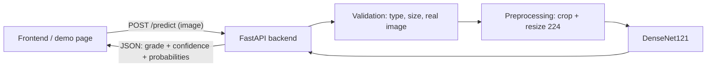

# Final Demo Guide — Member 3 (DenseNet + Backend)

Total time: about 10 minutes. Sections 1–4 explain, section 5 is the live demo.

---

## 0. Before the demo (do this 15 minutes earlier)

1. Check the trained model is present:
   ```bash
   cd ~/diabetic-retinopathy-member3
   ls -lh models/densenet121_dr.keras        # ~47 MB
   ls samples/                               # 5 fundus images, one per class
   ```
2. Start the backend and leave the terminal open:
   ```bash
   source .venv/bin/activate
   uvicorn backend.main:app --host 127.0.0.1 --port 8000
   ```
   Wait for `Model loaded and warmed up` (~12 s).
3. Open three browser tabs:
   - `http://127.0.0.1:8000/demo` — upload page
   - `http://127.0.0.1:8000/docs` — interactive API documentation
   - the GitHub repo README (results tables and plots)
4. Open the images in `results/` so they are ready to show:
   `class_distribution.png`, `sample_images.png`, `densenet121_training_curves.png`,
   `densenet121_confusion_matrix.png`, `sample_predictions.png`.

If something fails, see section 7.

---

## 1. Introduction (1 min)

> "Our project compares three deep learning models — DenseNet, ResNet and EfficientNet — for
> classifying diabetic retinopathy severity into 5 grades, using the APTOS 2019 dataset under the
> same experimental conditions. My part is the DenseNet model and the backend API that serves
> predictions to the frontend."

The 5 grades: 0 No DR · 1 Mild · 2 Moderate · 3 Severe · 4 Proliferative DR.

## 2. Dataset and preprocessing (2 min)

**Show:** `results/class_distribution.png`

- 3,662 labelled fundus images. Kaggle's test images have no labels, so we split the labelled set.
- Strong imbalance: 1,805 No DR vs only 193 Severe. Always predicting "No DR" would already give
  49% accuracy — this is why we use **class weights** and report **QWK and macro F1**, not only accuracy.
- Stratified split 70 / 15 / 15 with seed 42 → 2,564 train / 549 validation / 549 test.

**Show:** `results/sample_images.png`

- Original images come from different cameras, from 1050×1050 up to 3216×2136 pixels.
- Preprocessing: BGR→RGB, **crop the black border**, **resize to 224×224**. ImageNet normalisation
  is built into the model.
- One function (`src/preprocessing.py`) is used for training *and* the backend, so a live
  prediction is processed exactly like the training images.
- Point out the yellow spots (hard exudates) in the Severe example — still visible after resizing.
- Training images only: random flips, ±20° rotation, ±10% zoom and brightness (augmentation).

## 3. DenseNet121 model and training (2 min)

**Explain with the diagram:**

```
224×224×3 image → normalisation → DenseNet121 (4 dense blocks) → 7×7×1024 features
               → Global Average Pooling (1024) → Dropout 0.3 → Dense(5, softmax) → 5 probabilities
```

- **Dense connections:** each layer receives the feature maps of *all* earlier layers in its block
  (concatenation; ResNet *adds* instead). Fine details from early layers — like tiny
  microaneurysms — stay available to the final decision. Fewer parameters than ResNet50 (7 M vs 25 M).
- **Transfer learning:** ImageNet-pretrained weights.
- **Two-phase training** on a Colab T4 GPU (17.7 min):
  1. Base frozen, train only the new head — 10 epochs, lr 1e-3.
  2. Unfreeze the last dense block, fine-tune — 20 epochs, lr 1e-5, early stopping.

**Show:** `results/densenet121_training_curves.png`

- Dashed line = start of fine-tuning; validation loss drops further after it.
- Validation accuracy is slightly above training accuracy because augmentation and dropout make
  training harder on purpose — the model is **not overfitting**.
- Validation loss was still decreasing at epoch 30: more fine-tuning epochs could improve the
  result, but all three models must use the same budget for a fair comparison.

## 4. Results (2 min)

**Show:** README results table and `results/densenet121_confusion_matrix.png`

| Metric (549 test images) | Value |
|---|---|
| Accuracy | **75.2%** |
| Quadratic Weighted Kappa | **0.808** |
| Macro F1 | 0.578 |
| Inference | ~0.3 s per image on a laptop CPU |

- **QWK 0.81** (official APTOS metric) = strong agreement with the doctors' grades. QWK punishes
  predictions far from the true grade more than near misses.
- **No DR: 97% recall** — healthy eyes are reliably recognised.
- Most errors are between **neighbouring grades** (Moderate↔Mild, Severe↔Proliferative); only 1
  Proliferative eye was predicted as No DR. That is why QWK is much higher than macro F1.
- **Weakest class: Severe (31% recall)** — only 193 training-set examples and visually between
  Moderate and Proliferative.

**Show:** `results/sample_predictions.png` — green = correct, red = wrong.

## 5. Live backend demo (3 min)

**Architecture:**



**Steps:**

1. **`/demo` tab** — the status badge shows *model ready* (from `GET /health`).
2. Upload `samples/class0_31360e44ac64.png` → **No DR, 95.4%**. Point at the 5 probability bars.
3. Upload `samples/class1_4aa07d720638.png` → **Mild, 60.9%** (correct).
4. Upload `samples/class2_a688f20f8895.png` → predicted **Mild** (true: Moderate) — an honest
   near-miss of one grade, the typical error type from the confusion matrix.
5. **Error handling** — upload `requirements.txt` from the project folder →
   *"File type '.txt' is not supported"* (HTTP 415). The server keeps working: upload a valid image again.
6. **`/docs` tab** — show the three endpoints. Open `GET /model-info` → *Try it out* → *Execute*:
   model name, classes, preprocessing steps, training split, upload limits.
7. Point at the terminal: each request is logged with file name, prediction and time (~0.3 s).

**What the backend handles** (all covered by automated tests — 38 passing):

| Situation | Response |
|---|---|
| Valid PNG/JPEG | 200 + prediction |
| No file | 400 `MISSING_FILE` |
| Wrong type (.txt, GIF renamed .png) | 415 `UNSUPPORTED_FILE_TYPE` |
| Corrupted / truncated image | 422 `CORRUPTED_IMAGE` |
| > 10 MB or > 40 megapixels | 413 |
| Model crash | 500, server stays up |
| Model file missing | 503, `/health` shows *degraded* |
| Repeated / simultaneous requests | identical results; model loaded once, thread-safe |

## 6. Limitations and future work (30 s)

- 224×224 input makes the smallest lesions (Mild DR) harder to see; higher resolution could help.
- Severe class is under-represented; more data or targeted augmentation would help.
- Training stopped at the agreed epoch limit while still improving.
- Single train/test split; cross-validation would give more reliable numbers.
- Research prototype only — not a medical device.

---

## 7. Troubleshooting during the demo

| Problem | Fix |
|---|---|
| `uvicorn: command not found` | run `source .venv/bin/activate` first |
| `address already in use` | a server is already running — use it, or stop it with Ctrl+C in its terminal |
| `/health` shows *degraded* | `models/densenet121_dr.keras` missing → download it again from `MyDrive/DR_project/densenet121/` |
| Demo page says *unreachable* | the server is not running — start it (section 0, step 2) |
| First prediction slow | wait for `Model loaded and warmed up` before the first upload |
